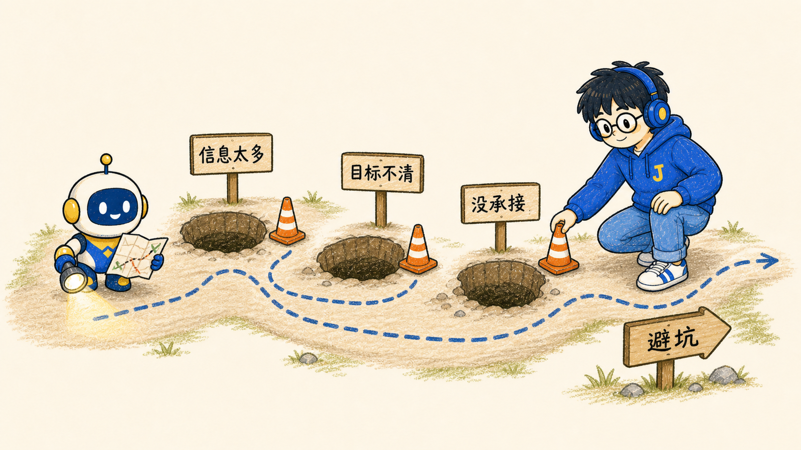
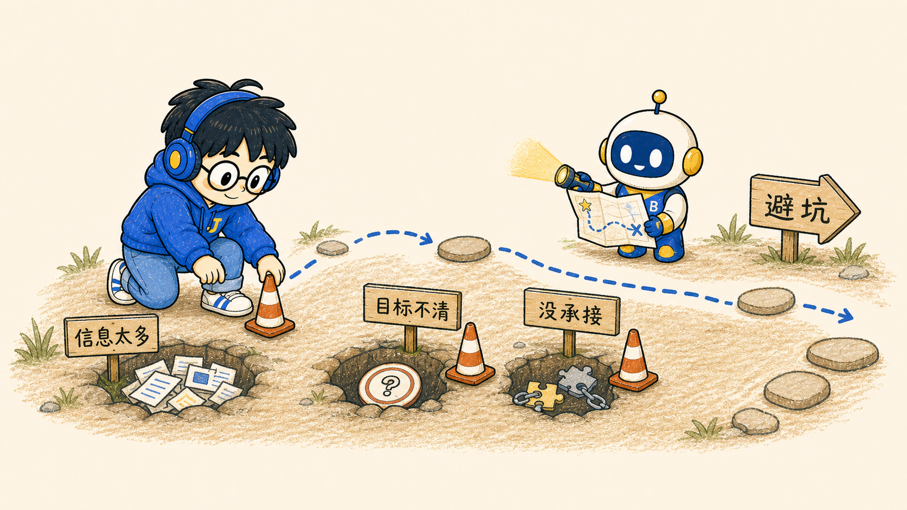
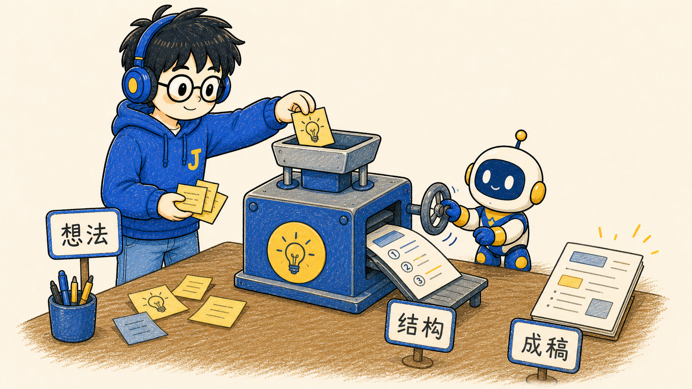

# Jeffrey Illustrations

> Build · Learn · Share 🚀
>
> 一个面向 AI Builder、DevOps 工程师和知识管理创作者的手绘正文配图 Skill。
>
> 16:9 横版｜Jeffrey IP｜温暖手绘｜蓝黄品牌色｜中文技术内容配图｜Codex Skill

---

## 这个仓库是什么

Jeffrey Illustrations 是一个基于个人 IP 的正文配图生成 Skill，用来指导 AI Agent 为中文文章、博客、公众号、GitHub README、Notion/Obsidian 文档和技术方法论内容生成统一风格的插图。

这个仓库是从 [`helloianneo/ian-xiaohei-illustrations`](https://github.com/helloianneo/ian-xiaohei-illustrations) fork / adaptation 而来。它刻意保留了小黑项目的 Skill-oriented 目录结构、README 阅读路径、references 拆分方式、shot list 工作流和 QA checklist 思路，让熟悉小黑项目的人一眼能看出结构来源。

同时，它不是小黑风格的换皮。默认视觉 IP 已改造为 **Jeffrey & Byte**：

- **Jeffrey**：一个温和、专注、喜欢折腾 AI / DevOps / HomeLab / Obsidian 的技术创作者。
- **Byte**：Jeffrey 的 AI 小助手，一个蓝黄配色、圆滚滚、偶尔犯迷糊但很可靠的小机器人。

一句话：让 AI 不只是“配一张图”，而是把技术文章里的一个关键认知动作，画成具有 Jeffrey 个人识别度的温暖手绘插图。

---

## Fork Lineage

这个项目的结构来源需要保持清晰：

- **结构基底来自小黑**：`SKILL.md`、`references/`、正文配图工作流、shot list 输出方式、QA checklist、示例提示词组织方式。
- **个人 IP 参考不二**：角色设定稿、表情/动作资产、个人品牌化视觉系统。
- **当前 IP 是 Jeffrey & Byte**：角色、配色、发型、服装、Byte 设定、技术创作者定位和默认提示词均为本项目自有改造。

因此，别人看这个仓库时，应该能立刻判断：这是一个基于小黑项目结构 fork 出来的 Jeffrey 个人 IP 插画 Skill。

---

## 示例效果

这个项目保留小黑项目的图例编号和主题语义，但用 Jeffrey & Byte 重新生成了两套示例图：

- **Jeffrey Original**：比例稍成熟，适合正文配图、README 横图、技术场景插画。
- **Jeffrey Q**：比例更圆润，适合头像、贴纸、社媒封面和轻量化 IP 资产。

完整图例集见 [`assets/examples/`](./assets/examples/)。

### 01 Two Breakpoints

| Jeffrey Original | Jeffrey Q |
| --- | --- |
|  |  |

### 02 Minimum Loop

| Jeffrey Original | Jeffrey Q |
| --- | --- |
|  |  |

### 03 Sort By Purpose

| Jeffrey Original | Jeffrey Q |
| --- | --- |
|  |  |

### 04 One Idea, Many Outputs

| Jeffrey Original | Jeffrey Q |
| --- | --- |
|  |  |

### 05 Handoff Path

| Jeffrey Original | Jeffrey Q |
| --- | --- |
|  |  |

### 06 Three Sources

| Jeffrey Original | Jeffrey Q |
| --- | --- |
|  |  |

### 07 Three Content Jobs

| Jeffrey Original | Jeffrey Q |
| --- | --- |
|  |  |

### 08 Handoff Copy Toolbox

| Jeffrey Original | Jeffrey Q |
| --- | --- |
|  |  |

### 09 Common Pits

| Jeffrey Original | Jeffrey Q |
| --- | --- |
|  |  |

### 10 Information Well

| Jeffrey Original | Jeffrey Q |
| --- | --- |
|  |  |

### 11 Idea Press

| Jeffrey Original | Jeffrey Q |
| --- | --- |
|  |  |

### 12 Content Fermentation

| Jeffrey Original | Jeffrey Q |
| --- | --- |
|  |  |

### 13 System Bearing

| Jeffrey Original | Jeffrey Q |
| --- | --- |
|  |  |

### 14 Trust Bridge

| Jeffrey Original | Jeffrey Q |
| --- | --- |
|  |  |

---

## 适合谁用

特别适合：

- 写 AI、DevOps、HomeLab、PKM、Obsidian、技术博客的人
- 想为中文文章生成统一正文配图的人
- 想把抽象技术概念画成具体隐喻的人
- 想建立个人 IP 插画资产库的人
- 用 Codex / ChatGPT / Claude / Gemini 做内容生产，希望稳定复用一套视觉语言的人

不适合：

- 想要商业 KV、精致扁平商业插画或复杂三维图的人
- 想要 PPT 信息图、架构大图或大量文字说明图的人
- 想要硬核黑客、赛博朋克、商务精英或儿童卡通风格的人
- 需要严格可编辑矢量源文件的人

---

## Jeffrey V1.0 Character DNA

### Jeffrey

- 年轻男性技术人 / 运维工程师 / AI Builder
- 清爽短发：**Jeffrey Hair™ = 短碎盖为主，轻微自然偏向；圆、短、碎、贴额头，不要明显四六分或侧扫成人刘海**
- 无胡子、无八字胡、无络腮胡
- 圆框眼镜
- 深蓝色头戴式耳机，黄色内圈
- Jeffrey Blue Hoodie，左胸黄色 `J` 标识
- 牛仔裤、白色运动鞋
- 气质：温和、专注、技术宅、轻松折腾感
- 常见姿态：侧脸、三分之二背影、坐在工位或家中折腾电脑

### Byte

- Jeffrey 的 AI 小助手
- 圆滚滚小机器人
- 蓝黄奶白配色
- 可以递咖啡、抱服务器、搬 Docker、举 MCP 拼图、递 Obsidian 笔记
- 是故事角色，不是装饰贴纸

### Brand Color

| 用途 | 色值 | 说明 |
| --- | --- | --- |
| Jeffrey Blue | `#5379E8` | Hoodie 主色 |
| Deep Headphone Blue | `#2F56C5` | 耳机、描边重点 |
| Warm Yellow | `#FFD84A` | J Logo、耳机内圈、Byte 点缀 |
| Cream Background | `#FFF9EE` | 默认背景 |
| Denim Blue | `#88A8F5` | 牛仔裤 |
| Line Dark | `#2B2F36` | 头发、线稿、深色文字 |

主视觉参考，两版并存：

- [`assets/references/jeffrey-byte-ab-reference.jpg`](./assets/references/jeffrey-byte-ab-reference.jpg)：Jeffrey Original。比例稍成熟、身体更修长，适合正文配图、README 横图、技术场景插画。
- [`assets/references/jeffrey-byte-v1-final.jpg`](./assets/references/jeffrey-byte-v1-final.jpg)：Jeffrey Q。比例更圆润、更亲和，适合头像、表情、贴纸、社媒封面和轻量化视觉资产。

两版共享同一套角色身份、发型、服装、品牌色和 Byte 设定。生成图片时先根据使用场景选择版本；用户未指定时，正文配图默认使用 Original，头像/贴纸/表情默认使用 Q。

---

## 视觉风格

这个 Skill 默认使用 **Jeffrey Warm Tech Illustration** 风格：

- 温暖手绘、蜡笔/彩铅质感
- 蓝黄品牌色，高留白
- 粗线条、轻微手绘抖动
- 不幼稚，但可爱、有品质
- 一张图只表达一个核心动作、结构、状态或隐喻
- Jeffrey 或 Byte 必须参与核心动作，不能只是站在角落
- 中文标注越短越好，优先 2~6 个字
- 技术味来自物件和动作，不靠黑客氛围

---

## 它会产出什么

默认输出：

- 16:9 横版正文配图
- 一篇文章的 4-8 张 shot list
- 每张图的主题、核心意思、结构类型、Jeffrey/Byte 动作和中文标注建议
- 最终 PNG 图片，保存到 workspace 的 `assets/<article-slug>-illustrations/`

也可以输出：

- 方形头像 / 社交头像
- GitHub README 插图
- 技能图标 / Skill illustration
- Blog / Obsidian / PKM 场景图
- Sticker / 表情图

---

## 示例用法

### 只做配图规划

```text
Use $jeffrey-illustrations 先不要生图。
请分析下面这篇文章哪里值得配图，输出 5 张左右的 shot list。
每张图写清楚：放在哪段后、主题、核心意思、结构类型、Jeffrey/Byte 在做什么、建议中文标注词。

<粘贴文章>
```

### 直接生成正文配图

```text
Use $jeffrey-illustrations 把下面这篇文章生成 4 张 Jeffrey 风格正文配图。
要求：16:9 横版、温暖手绘、Jeffrey Blue Hoodie、Byte 小机器人、少量中文短标注。

<粘贴文章>
```

### 为单个概念生成一张图

```text
Use $jeffrey-illustrations 为“AI Agent 不是一个工具，而是一条可观察的工作流”生成一张正文配图。
画面要温暖、清爽、有技术隐喻，Jeffrey 或 Byte 必须承担核心动作。
```

更多示例见 [`examples/prompts.md`](./examples/prompts.md)。

---

## 工作流程

1. 读取文章、Markdown、Notion/Obsidian 内容、截图或用户给的主题
2. 提炼核心观点、认知转折、流程结构和适合视觉化的段落
3. 先输出 shot list：每张图只选一个认知锚点
4. 为每张图选择结构类型：Workflow、系统局部、前后对比、角色状态、概念隐喻、方法分层、地图路线或小漫画分镜
5. 重新发明一个低科技、温暖但成立的物理隐喻
6. 让 Jeffrey 或 Byte 承担核心动作
7. 每张图单独调用图像模型生成
8. 按 QA checklist 检查：角色一致、颜色一致、文字少、动作成立、非 PPT 感、非旧案例复刻
9. 保存最终 PNG，并报告用途和路径

---

## 目录结构

```text
.
├── README.md
├── LICENSE
├── NOTICE.md
├── assets/
│   ├── brand/
│   ├── references/
│   └── examples/
│       ├── original/
│       └── q/
├── docs/
│   ├── character.md
│   ├── byte.md
│   ├── style-guide.md
│   ├── brand.md
│   ├── roadmap.md
│   └── prompt-system.md
├── examples/
│   └── prompts.md
└── jeffrey-illustrations/
    ├── SKILL.md
    ├── agents/
    │   └── openai.yaml
    ├── assets/
    │   └── examples/
    │       ├── original/
    │       └── q/
    └── references/
        ├── style-dna.md
        ├── jeffrey-ip.md
        ├── byte-ip.md
        ├── composition-patterns.md
        ├── prompt-template.md
        └── qa-checklist.md
```

真正需要安装到 Codex 的是子目录：

```text
jeffrey-illustrations/
```

---

## 安装

克隆仓库：

```bash
git clone https://github.com/liyongjian5179/jeffrey-illustrations.git
cd jeffrey-illustrations
```

复制 Skill 到 Codex skills 目录：

```bash
mkdir -p "${CODEX_HOME:-$HOME/.codex}/skills"
cp -R ./jeffrey-illustrations "${CODEX_HOME:-$HOME/.codex}/skills/"
```

安装后，在 Codex 里使用：

```text
Use $jeffrey-illustrations 为这篇中文技术文章设计并生成 5 张 Jeffrey 风格正文配图。
```

---

## 注意事项

- 图片里的中文文字越短越稳定。
- 每张图只讲一个核心结构，不要把文章做成说明书。
- Jeffrey / Byte 必须承担核心动作；如果去掉角色画面仍然完全成立，说明角色太装饰。
- 示例图只用于校准风格，不要复刻构图。
- AI 图像模型可能出现错字、Logo 漂移、角色比例漂移，生成后必须检查。
- 如果中文错字严重，优先减少标注词并重生成。

---

## Acknowledgements

This project is structurally forked / adapted from:

- [`helloianneo/ian-xiaohei-illustrations`](https://github.com/helloianneo/ian-xiaohei-illustrations)

It also references the personal IP asset approach of:

- [`esthersjw/esther-illustrations`](https://github.com/esthersjw/esther-illustrations)

Respect the structure. Preserve the lineage. Reinvent the character.

---

## License

MIT License. See [`LICENSE`](./LICENSE).
